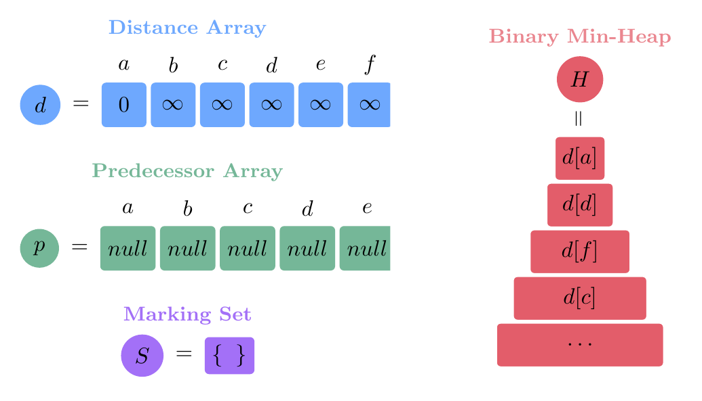
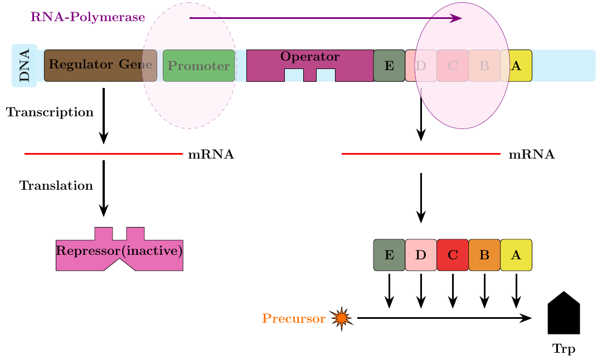
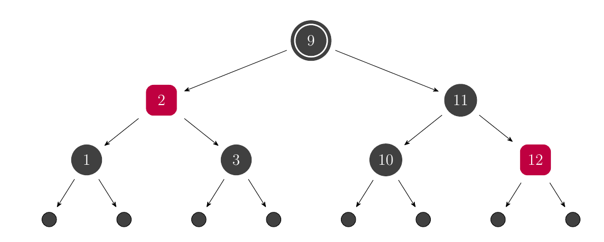

	<h1>Educational Templates</h1> 
	

This repository contains educational material for your presentations, projects, lectures, etc. All materials werde made with Open-Source tools such as Latex, LibreOffice Draw and Python.

<h2>Examples</h2>

Take a look at some highlights of this project:

<h2>Links</h2>

For more help / inspiration / examples, have a look at these links.

<ul>
<li><a href="https://texample.net/">TEXample.net</a></li>
<li><a href="https://www.latextemplates.com/">LaTeX Templates</a></li>
<li><a href="https://tikz.dev/">PGF/Tikz Manual</a></li>
<li><a href="https://detexify.kirelabs.org/classify.html">Detexify</a></li>
<li><a href="https://github.com/MohamedYoussouf/Design-Resources">GitHub repo with additional links</a></li>
</ul>

Software that was used / that you can use.

<ul>
<li><a href="https://www.libreoffice.org/">Libre Office (Draw)</a></li>
<li><a href="https://www.python.org/">Python</a></li>
<li><a href="https://www.latex-project.org/">Latex</a></li>
<li><a href="https://www.yworks.com/products/yed">yEd - graph editor</a></li>
</ul>

<h2>License</h2>

This project is licensed under GPL-3.0 license. For more information, checkout <a href="https://github.com/BenSt099/LaTeX-Templates/blob/main/LICENSE">License</a>

