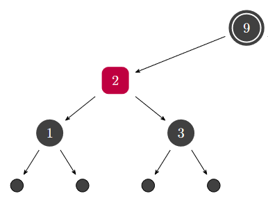
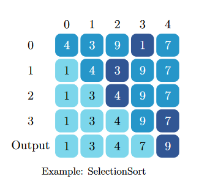
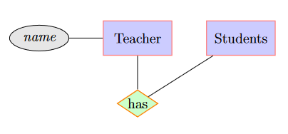
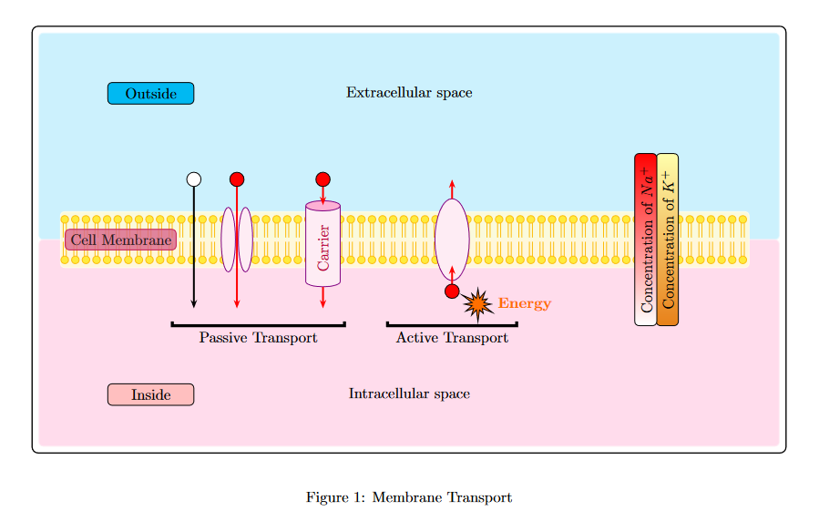
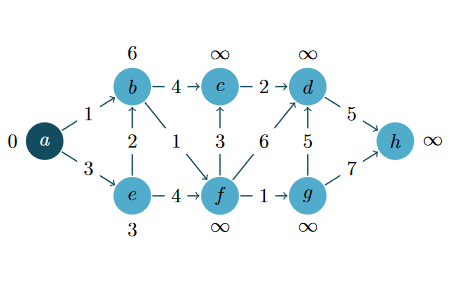
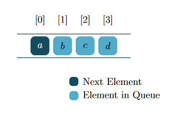
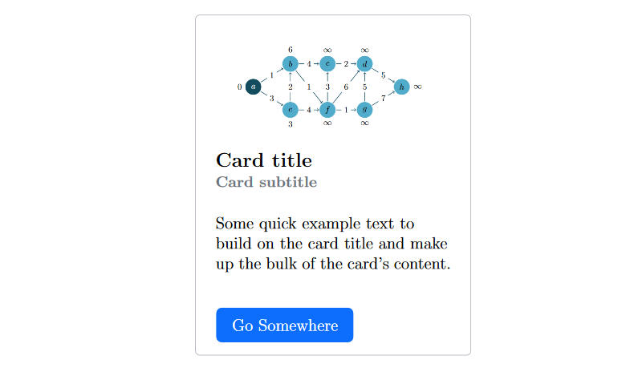
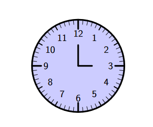
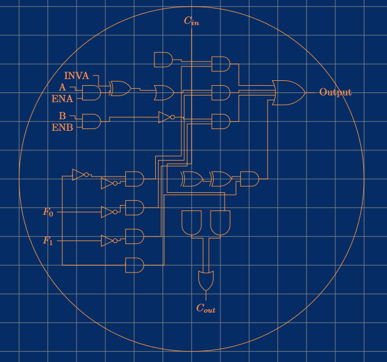

	<h1>LaTeX-Templates</h1> 
	
	

Latex has a lot of features to make your project beautiful. This repo provides some examples from various topics.

<h2>Examples</h2>

<table width="100%" margin-left="auto" margin-right="auto">
	<tr>
		<th>Red-Black-Trees</th>
		<th>Sorting-Algorithm</th>
		<th>ER-Diagram</th>
	</tr>
	<tr>
		<td width="33%">
			
		</td>
		<td width="33%">
			
		</td>
		<td width="33%">
			
		</td>
	</tr>
</table>

<table width="100%" margin-left="auto" margin-right="auto">
	<tr>
		<th>MTrans</th>
		<th>Shortest-Path-Graph</th>
		<th>Queue</th>
	</tr>
	<tr>
		<td width="33%">
			
		</td>
		<td width="33%">
			
		</td>
		<td width="33%">
			
		</td>
	</tr>
</table>

<table width="100%" margin-left="auto" margin-right="auto">
	<tr>
		<th>Card</th>
		<th>Clock</th>
		<th>Circuits</th>
	</tr>
	<tr>
		<td width="33%">
			
		</td>
		<td width="33%">
			
		</td>
		<td width="33%">
			
		</td>
	</tr>
</table>

<h2>Highlights</h2>

Take a look at some highlights that you may not see in other projects.

<ul>
<li>The two projects <b>Stack-2</b> and <b>Gen-LinkedLists</b> provide an easy interface for generating a stack or a linked list. Just import the packages, create a new environment, pass some arguments and these structures will be automatically generated for you.</li>
<li>Are you familiar with <a href="https://getbootstrap.com/">Bootstrap</a>? There are some nice implementations from Bootstrap's color system, Bootstrap's card container and Bootstrap's push notifications (toasts).</li>
</ul>

<h2>Links</h2>

For more help / inspiration / examples, have a look at these links.

<ul>
<li><a href="https://texample.net/">TEXample.net</a></li>
<li><a href="https://www.latextemplates.com/">LaTeX Templates</a></li>
<li><a href="https://tikz.dev/">PGF/Tikz Manual</a></li>
<li><a href="https://detexify.kirelabs.org/classify.html">Detexify</a></li>
</ul>

<h2>License</h2>

This project is licensed under GPL-3.0 license. For more information, checkout <a href="https://github.com/BenSt099/LaTeX-Templates/blob/main/LICENSE">License</a>

