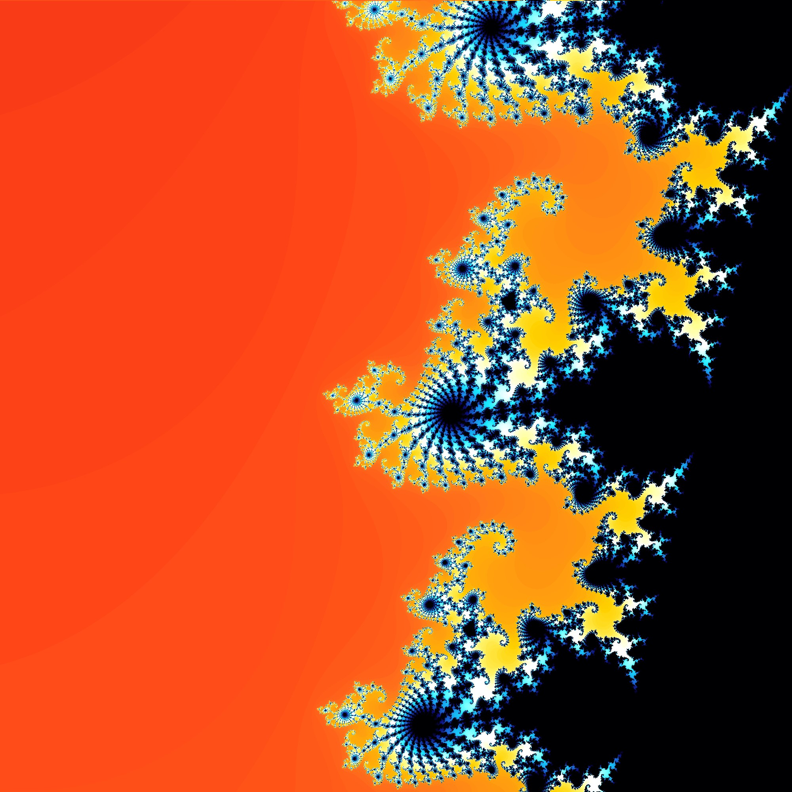

	<h1>Educational Templates</h1> 
	

This repository contains educational material for your presentations, projects, lectures, etc. All materials werde made with Open-Source tools such as Latex, LibreOffice Draw and Python.

<h2>Examples</h2>

Take a look at some highlights of this project:

<!--

<h2>Highlights</h2>

Take a look at some highlights that you may not see in other projects.

<ul>
<li>The two projects <b>Stack-2</b> and <b>Gen-LinkedLists</b> provide an easy interface for generating a stack or a linked list. Just import the packages, create a new environment, pass some arguments and these structures will be automatically generated for you.</li>
<li>Are you familiar with <a href="https://getbootstrap.com/">Bootstrap</a>? There are some nice implementations from Bootstrap's color system, Bootstrap's card container and Bootstrap's push notifications (toasts).</li>
</ul>

<h2>Links</h2>

For more help / inspiration / examples, have a look at these links.

<ul>
<li><a href="https://texample.net/">TEXample.net</a></li>
<li><a href="https://www.latextemplates.com/">LaTeX Templates</a></li>
<li><a href="https://tikz.dev/">PGF/Tikz Manual</a></li>
<li><a href="https://detexify.kirelabs.org/classify.html">Detexify</a></li>
</ul>
-->

<h2>License</h2>

This project is licensed under GPL-3.0 license. For more information, checkout <a href="https://github.com/BenSt099/LaTeX-Templates/blob/main/LICENSE">License</a>

